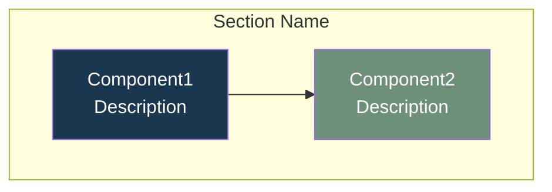
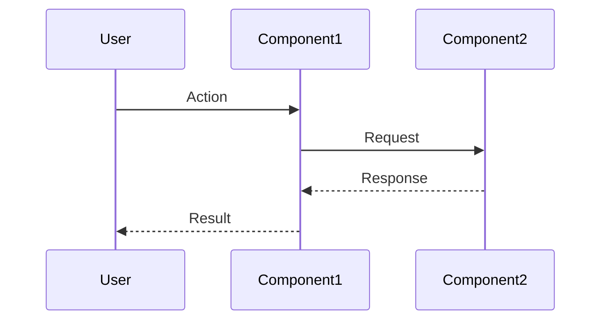
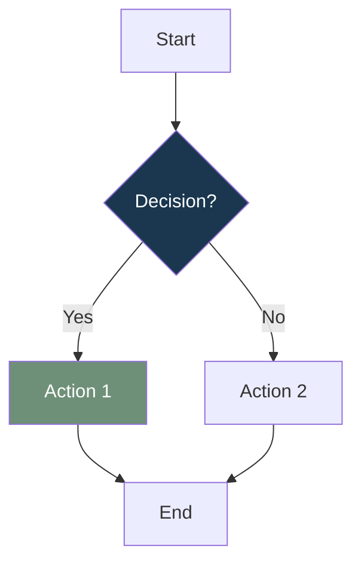

# Automatic Documentation Updates

## Mandatory Rule

**When you make ANY code changes, you MUST automatically update the relevant documentation files and include those updates in the SAME commit as the code changes.**

Documentation updates are NOT optional—they are part of the code change itself.

## When to Update Documentation

### Always Update Documentation When:

1. **Adding new components** (`frontend/src/components/*.tsx`)
   - Update: `docs/architecture/component-relationships.md`
   - Update: `docs/architecture/data-flow.md` (if affects user flow)
   - Update: `docs/user/features.md` (if new user-facing feature)

2. **Adding new pages** (`frontend/src/pages/*.tsx`)
   - Update: `docs/architecture/data-flow.md`
   - Update: `docs/user/user-guide.md`
   - Update: `docs/user/features.md`
   - Update: `docs/architecture/component-relationships.md`

3. **Adding new contexts/hooks** (`frontend/src/contexts/*.tsx`, `frontend/src/hooks/*.ts`)
   - Update: `docs/architecture/system-architecture.md`
   - Update: `docs/architecture/data-flow.md`
   - Update: `docs/architecture/component-relationships.md`

4. **Adding new API endpoints** (`backend/**/*.cs`)
   - Update: `docs/developer/api-reference.md`
   - Update: `docs/architecture/data-flow.md`
   - Update: `docs/architecture/system-architecture.md`

5. **Adding new services** (`backend/Services/*.cs`)
   - Update: `docs/architecture/system-architecture.md`
   - Update: `docs/architecture/component-relationships.md`
   - Update: `docs/architecture/data-flow.md`

6. **Changing user flows or interactions**
   - Update: `docs/architecture/data-flow.md` (update Mermaid diagrams)
   - Update: `docs/user/user-guide.md`
   - Update: `docs/user/features.md`

7. **Changing infrastructure** (`infrastructure/*.yaml`, `.github/workflows/*.yml`)
   - Update: `docs/architecture/deployment-architecture.md`
   - Update: `docs/architecture/system-architecture.md`
   - Update: `docs/developer/deployment.md`

8. **Adding new features**
   - Update: `docs/user/features.md`
   - Update: `docs/user/user-guide.md`
   - Update: `docs/architecture/data-flow.md` (if affects flow)

## Code-to-Documentation Mapping

### Frontend Changes

| Code Path | Documentation Files to Update |
|-----------|------------------------------|
| `frontend/src/pages/Home.tsx` | `data-flow.md`, `user-guide.md`, `features.md`, `component-relationships.md` |
| `frontend/src/pages/Admin.tsx` | `data-flow.md`, `component-relationships.md` |
| `frontend/src/components/VerseDisplay.tsx` | `component-relationships.md`, `features.md` |
| `frontend/src/components/AmenButton.tsx` | `data-flow.md`, `user-guide.md`, `component-relationships.md` |
| `frontend/src/components/ReflectionView.tsx` | `data-flow.md`, `user-guide.md`, `features.md` |
| `frontend/src/components/LanguageSwitcher.tsx` | `data-flow.md`, `user-guide.md`, `features.md` |
| `frontend/src/contexts/LanguageContext.tsx` | `system-architecture.md`, `data-flow.md`, `component-relationships.md` |
| `frontend/src/hooks/*.ts` | `system-architecture.md`, `data-flow.md` |

### Backend Changes

| Code Path | Documentation Files to Update |
|-----------|------------------------------|
| `backend/Services/VerseService.cs` | `system-architecture.md`, `component-relationships.md`, `data-flow.md`, `api-reference.md` |
| `backend/AppConfiguration.cs` | `system-architecture.md`, `component-relationships.md`, `api-reference.md` |
| `backend/Program.cs` | `system-architecture.md`, `deployment-architecture.md` |
| `backend/LambdaEntryPoint.cs` | `system-architecture.md`, `deployment-architecture.md` |
| `backend/Data/*.cs` | `system-architecture.md`, `component-relationships.md` |

### Infrastructure Changes

| Code Path | Documentation Files to Update |
|-----------|------------------------------|
| `infrastructure/template.yaml` | `deployment-architecture.md`, `system-architecture.md`, `developer/deployment.md` |
| `.github/workflows/*.yml` | `deployment-architecture.md`, `developer/deployment.md` |

## How to Update Documentation

### Step 1: Identify What Changed

Analyze the code changes:
- **New component/page?** → Add to component diagrams and user flows
- **New API endpoint?** → Add to API reference and data flow
- **Changed user flow?** → Update Mermaid diagrams in `data-flow.md`
- **New feature?** → Update user guide and features list
- **Infrastructure change?** → Update deployment architecture

### Step 2: Update Architecture Diagrams

#### For Component Changes:
1. Open `docs/architecture/component-relationships.md`
2. Find the relevant Mermaid diagram section
3. Add new components/nodes to the diagram
4. Update relationships/edges
5. Maintain consistent styling (use brand colors: `#1a374f`, `#6f9078`, `#d06450`)

#### For Data Flow Changes:
1. Open `docs/architecture/data-flow.md`
2. Identify which flow diagram is affected
3. Update the Mermaid sequence diagram or flow chart
4. Add new steps/participants
5. Update decision points if logic changed

#### For System Architecture Changes:
1. Open `docs/architecture/system-architecture.md`
2. Update the high-level architecture diagram
3. Add new services/components to the appropriate layer
4. Update the "Architecture Layers" section text

### Step 3: Update User Documentation

#### For User-Facing Changes:
1. Open `docs/user/user-guide.md`
2. Find the relevant section or create a new one
3. Update step-by-step instructions
4. Add screenshots/examples if needed

#### For Feature Changes:
1. Open `docs/user/features.md`
2. Find the feature section or add a new one
3. Update feature description
4. Update user scenarios if flow changed

### Step 4: Update API Documentation

#### For API Changes:
1. Open `docs/developer/api-reference.md`
2. Find the endpoint section or add new one
3. Update endpoint path, parameters, response format
4. Update request/response examples
5. Update error codes if changed

### Step 5: Update Developer Documentation

#### For Infrastructure/Deployment Changes:
1. Open `docs/architecture/deployment-architecture.md`
2. Update AWS architecture diagram
3. Update deployment steps in `docs/developer/deployment.md`

## Mermaid Diagram Update Guidelines

### Component Relationships Diagram Format:


### Data Flow Sequence Diagram Format:


### Flow Chart Format:


## Commit Workflow

### Required Commit Structure:

When making code changes, your commit MUST include:

1. **Code changes** (`.tsx`, `.ts`, `.cs`, `.yaml`, etc.)
2. **Documentation updates** (`docs/**/*.md`)
3. **Both in the same commit**

### Commit Message Format:

```
feat: add new feature name

- Add new component/feature description
- Update architecture diagrams
- Update user guide
- Update API reference (if applicable)

Documentation updated:
- docs/architecture/data-flow.md
- docs/user/user-guide.md
- docs/user/features.md
```

### Example Workflow:

```bash
# 1. Make code changes
# Edit frontend/src/components/NewFeature.tsx

# 2. IMMEDIATELY update documentation
# Edit docs/architecture/component-relationships.md
# Edit docs/user/features.md
# Edit docs/architecture/data-flow.md

# 3. Stage BOTH code and docs together
git add frontend/src/components/NewFeature.tsx
git add docs/architecture/component-relationships.md
git add docs/user/features.md
git add docs/architecture/data-flow.md

# 4. Commit together
git commit -m "feat: add new feature component

- Add NewFeature component with X functionality
- Update component relationships diagram
- Add sharing feature to user documentation
- Update data flow diagram

Documentation updated:
- docs/architecture/component-relationships.md
- docs/user/features.md
- docs/user/user-guide.md
- docs/architecture/data-flow.md"
```

### Example 2: Adding a New API Endpoint

**Code Change:**
```csharp
// backend/AppConfiguration.cs
endpoints.MapGet("/api/verse/favorite", ...)
```

**Required Documentation Updates:**
1. `docs/developer/api-reference.md` - Add new endpoint documentation
2. `docs/architecture/data-flow.md` - Update API request flow
3. `docs/architecture/system-architecture.md` - Update endpoints list
4. `docs/user/features.md` - Add favorite feature (if user-facing)

**Commit:**
```bash
git add backend/AppConfiguration.cs
git add docs/developer/api-reference.md
git add docs/architecture/data-flow.md
git add docs/architecture/system-architecture.md
git add docs/user/features.md
git commit -m "feat: add favorite verse endpoint

- Add GET /api/verse/favorite endpoint
- Update API reference documentation
- Update data flow diagram
- Add favorite feature to user docs

Documentation updated:
- docs/developer/api-reference.md
- docs/architecture/data-flow.md
- docs/architecture/system-architecture.md
- docs/user/features.md"
```

## Integration with Cursor and Claude

### For Cursor AI:
- This file is automatically loaded via `.cursorrules`
- Cursor will reference this rule when making code changes
- Cursor will automatically suggest documentation updates

### For Claude AI:
- Reference this file explicitly: `Agents/rules/auto-documentation.md`
- Claude will follow these rules when analyzing code changes
- Claude will automatically update documentation as part of code changes

## Summary

**Remember:** Code changes and documentation updates are inseparable. Every code change MUST include corresponding documentation updates in the same commit. This ensures documentation stays current and accurate.
