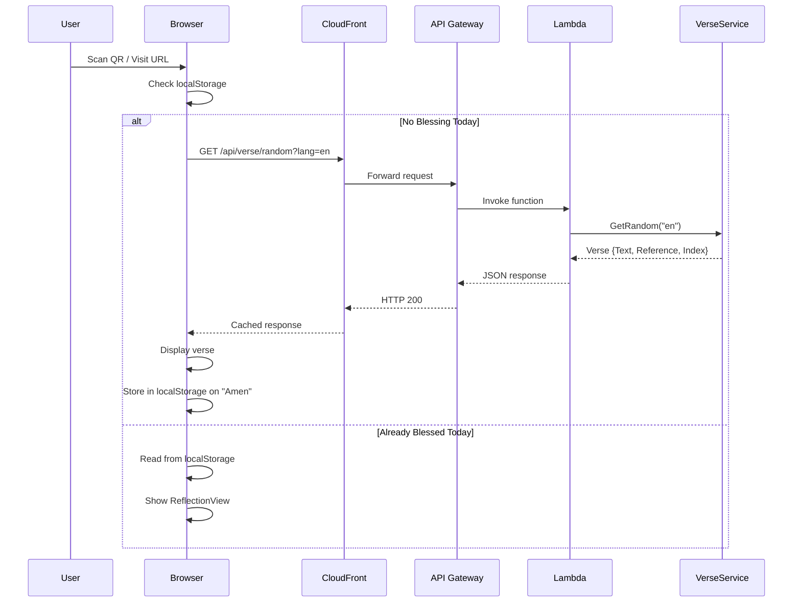
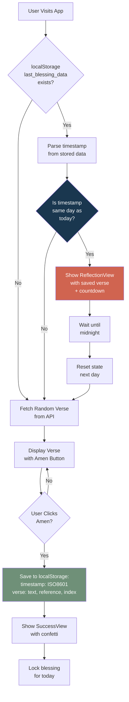
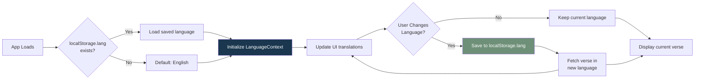
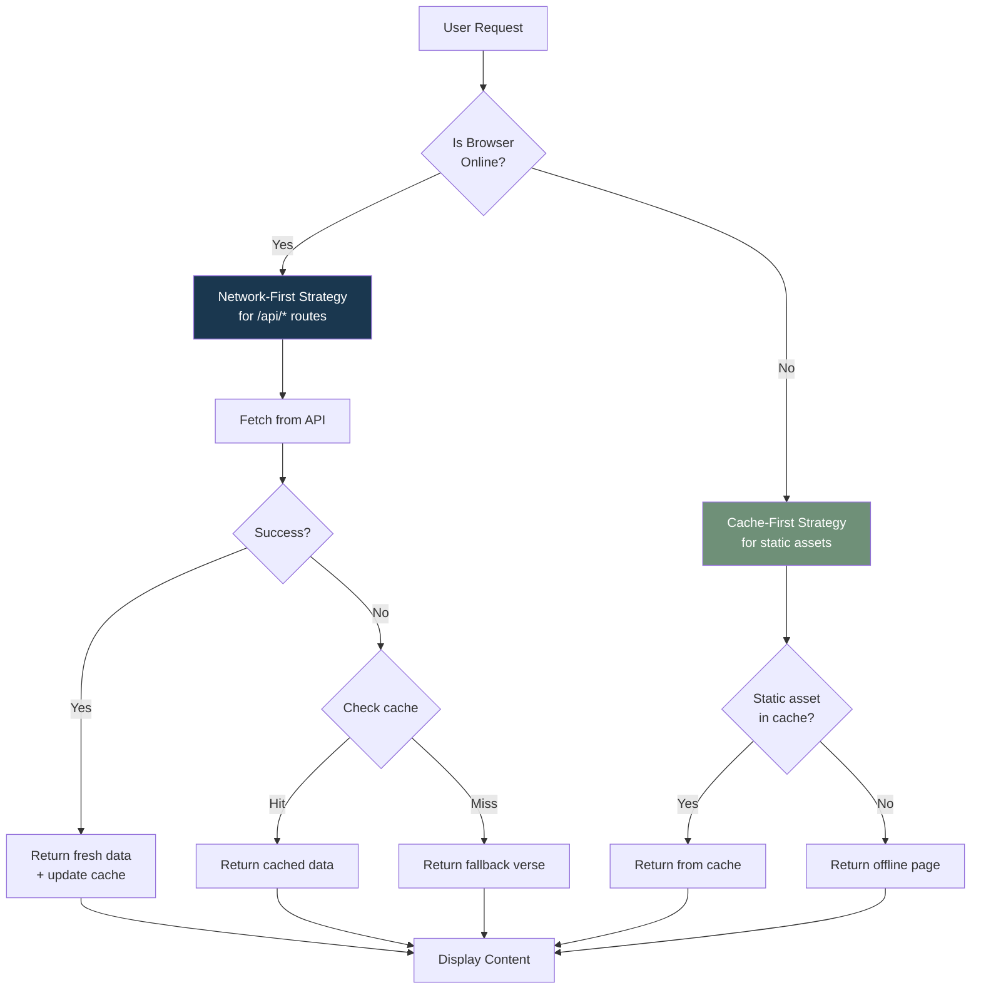

# Data Flow

## Request Flow: Getting a Verse



## Daily Blessing State Flow



## Language Selection Flow



## PWA Offline Flow



## API Response Structure

### Verse Endpoint Response
```json
{
  "text": "For I know the plans I have for you...",
  "reference": "Jeremiah 29:11",
  "index": 23
}
```

### Health Check Response
```json
{
  "status": "healthy",
  "timestamp": "2026-02-06T12:34:56.789Z"
}
```

## localStorage Schema

### `last_blessing_data`
```typescript
{
  timestamp: "2026-02-06T08:30:00.000Z",  // ISO8601
  verse: {
    text: "For I know the plans...",
    reference: "Jeremiah 29:11",
    index: 23
  }
}
```

### `lang`
```typescript
"en" | "am" | "fi"  // Language preference
```
