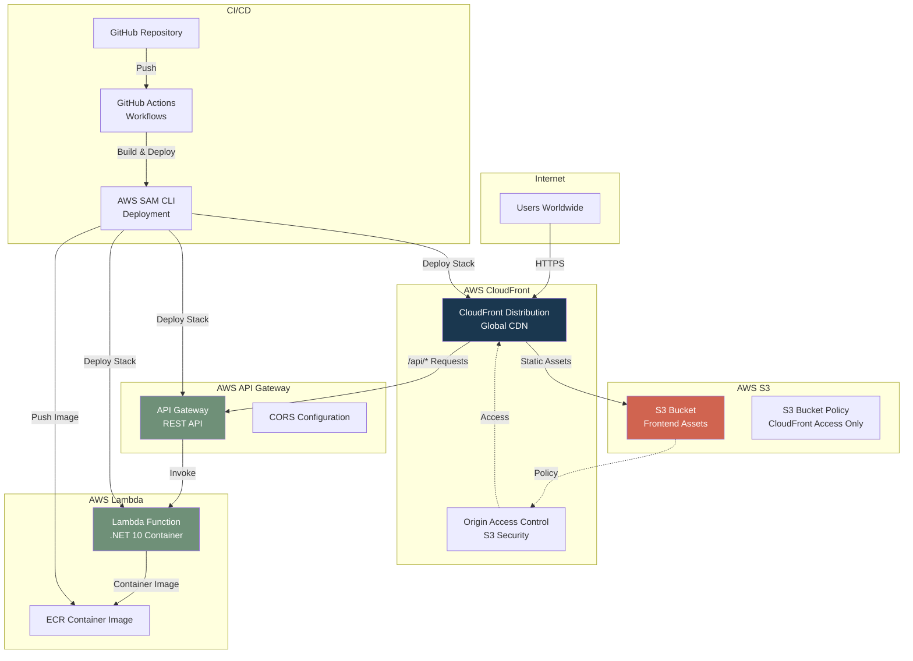
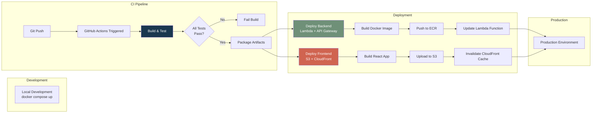

# Deployment Architecture

## AWS Infrastructure Overview

## Deployment Pipeline

## Infrastructure Components

### CloudFront Distribution
- **Purpose**: Global CDN for static assets and API proxy
- **Behaviors**:
  - Default: S3 origin (static assets)
  - `/api/*`: API Gateway origin (backend API)
- **Caching**:
  - Static assets: Cache-first (24h default TTL)
  - API routes: Network-first (5min default TTL)
- **Security**: Origin Access Control (OAC) for S3

### S3 Bucket
- **Purpose**: Host frontend React build artifacts
- **Configuration**:
  - Versioning enabled
  - Private bucket (only CloudFront access)
  - Bucket policy restricts access to CloudFront
- **Content**: HTML, CSS, JS, images, manifest, service worker

### API Gateway
- **Purpose**: REST API endpoint for backend
- **Endpoints**:
  - `GET /api/verse/random`
  - `GET /api/health`
- **CORS**: Configurable via `ALLOWED_ORIGIN` parameter
- **Integration**: Lambda proxy integration

### Lambda Function
- **Purpose**: Serverless backend compute
- **Runtime**: .NET 10 container image
- **Configuration**:
  - Memory: 512 MB
  - Timeout: 30 seconds
  - Environment variables: `ASPNETCORE_ENVIRONMENT`, `ALLOWED_ORIGIN`
- **Deployment**: Container image from ECR

### ECR (Elastic Container Registry)
- **Purpose**: Store Lambda container images
- **Image**: `encourager-api:latest` (or tagged version)
- **Build**: Dockerfile in backend directory

## Deployment Scripts

### Backend Deployment (`scripts/deploy-backend.sh`)
1. Build Docker image
2. Push to ECR
3. Deploy SAM stack (Lambda + API Gateway)
4. Update Lambda function with new image

### Frontend Deployment (`scripts/deploy-frontend.sh`)
1. Build React app (`npm run build`)
2. Upload to S3 bucket
3. Invalidate CloudFront cache

## Environment Variables

### Lambda Environment
- `ASPNETCORE_ENVIRONMENT`: `prod`, `staging`, or `dev`
- `ALLOWED_ORIGIN`: CORS allowed origin (default: `*`)

### SAM Template Parameters
- `Environment`: Environment name (`prod`, `staging`, `dev`)
- `DomainName`: Optional custom domain
- `ImageTag`: Docker image tag (default: `latest`)
- `AllowedOrigin`: CORS origin (default: `*`)

## Security Considerations

1. **S3 Bucket**: Private, only accessible via CloudFront OAC
2. **CORS**: Configurable origin restriction (should be CloudFront URL in production)
3. **HTTPS**: Enforced via CloudFront (redirect HTTP to HTTPS)
4. **API Gateway**: No authentication required (public API)
5. **Lambda**: VPC not required (stateless function)

## Monitoring & Logging

- **CloudWatch Logs**: Lambda function logs
- **CloudFront Logs**: Access logs (optional)
- **API Gateway Logs**: Request/response logs (optional)
- **Health Check**: `/api/health` endpoint for monitoring

## Cost Optimization

1. **Serverless**: Pay only for Lambda invocations
2. **CloudFront**: Free tier includes 1TB data transfer
3. **S3**: Pay for storage and requests (minimal for static site)
4. **API Gateway**: Pay per API call (free tier: 1M requests/month)
